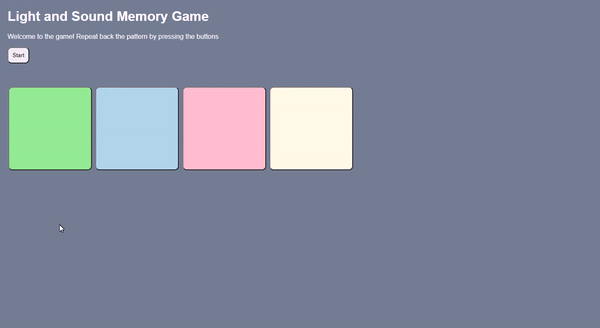

# Pre-work - *Memory Game*

**Memory Game** is a Light & Sound Memory game to apply for CodePath's SITE Program. 

Submitted by: Qian Yi He

Time spent: 4 hours spent in total

Link to project: https://glitch.com/edit/#!/neighborly-cream-screwdriver?path=index.html%3A29%3A47

## Required Functionality

The following **required** functionality is complete:

* [x] Game interface has a heading (h1 tag), a line of body text (p tag), and four buttons that match the demo app
* [x] "Start" button toggles between "Start" and "Stop" when clicked. 
* [x] Game buttons each light up and play a sound when clicked. 
* [x] Computer plays back sequence of clues including sound and visual cue for each button
* [x] Play progresses to the next turn (the user gets the next step in the pattern) after a correct guess. 
* [x] User wins the game after guessing a complete pattern
* [x] User loses the game after an incorrect guess

The following **optional** features are implemented:

* [ ] Any HTML page elements (including game buttons) has been styled differently than in the tutorial
* [ ] Buttons use a pitch (frequency) other than the ones in the tutorial
* [ ] More than 4 functional game buttons
* [x] Playback speeds up on each turn
* [x] Computer picks a different pattern each time the game is played
* [ ] Player only loses after 3 mistakes (instead of on the first mistake)
* [ ] Game button appearance change goes beyond color (e.g. add an image)
* [ ] Game button sound is more complex than a single tone (e.g. an audio file, a chord, a sequence of multiple tones)
* [ ] User has a limited amount of time to enter their guess on each turn

The following **additional** features are implemented:

- [ ] List anything else that you can get done to improve the app!

## Video Walkthrough

Here's a walkthrough of implemented user stories:

 

## Reflection Questions
1. If you used any outside resources to help complete your submission (websites, books, people, etc) list them here. 
I did a similar project during high school. So I used that as a reference to write this code. I also used w3school.com to search up some commands.

2. What was a challenge you encountered in creating this submission (be specific)? How did you overcome it? (recommended 200 - 400 words) 
      During this challenge, I had trouble with the optional feature of generating a new pattern at the start of each game. I first attempted by adding the generated pattern function and tried to generate the whole array when the game begins. But I realized that there's a simpler way to program the guess function because my pattern is generated randomly. Instead of generating the full array of patterns, adding a randomly generated number to the pattern after every time the player won that round would make my code simpler than before. I took out the original for-loop I used to compare two arrays to just making sure that the user is pressing the right button in the pattern in the right order. I also changed the number entered into the guess function to make this process easier. There was also a time when I got stuck because I had a small bug in my code. It took me quite a long time to find that bug. The bug was caused because I incremented the progress variable on the wrong line. That bug caused the content in m if loop to not be compiled. I just had to increment the variable before the if comparison. I'm glad it's solved.

3. What questions about web development do you have after completing your submission? (recommended 100 - 300 words) 
I have a question about how to web development process works. For example, like now, we wrote a program. What comes after? Do we test it? When do we know we can launch a program? How do we know whether or not it's good? Also, I want to learn about some cutting-edge technologies used in web development. I am familiar with HTML and javascript, but I don't know what to do from here if I want to pursue the web development field. I feel like this opportunity will allow me to move forward. I'm also excited to see how professionals use these technologies.

4. If you had a few more hours to work on this project, what would you spend them doing (for example: refactoring certain functions, adding additional features, etc). Be specific. (recommended 100 - 300 words) 
If I have more time, I would try to increment all the extra features into the program.

## License

    Copyright Qian Yi He

    Licensed under the Apache License, Version 2.0 (the "License");
    you may not use this file except in compliance with the License.
    You may obtain a copy of the License at

        http://www.apache.org/licenses/LICENSE-2.0

    Unless required by applicable law or agreed to in writing, software
    distributed under the License is distributed on an "AS IS" BASIS,
    WITHOUT WARRANTIES OR CONDITIONS OF ANY KIND, either express or implied.
    See the License for the specific language governing permissions and
    limitations under the License.
